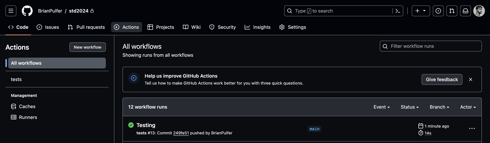

# Data Structures (Spring 2024) Exercises - University of Geneva

## Contents
 - **TP0**: Introduction to C, and VSCode (making sure you can debug)
 - **TP1**: Simple data types and pointers
 - **TP2**: Stack, Queue, List
 - **TP3**: Trees, AVL Trees
 - **TP4**: Graphs
 - **TP5**: Hashing, Hash Tables, chaining, linear probing


## Set-up local environment
### VSCode
If not installed, download and install [Visual Studio Code](https://code.visualstudio.com/). If not installed, install it with:

- **Linux:** `sudo apt-get install code`
- **MacOS:** From the [website](https://code.visualstudio.com/)
- **Windows:** From the [website](https://code.visualstudio.com/)

Make sure you install the [C/C++ extension](https://marketplace.visualstudio.com/items?itemName=ms-vscode.cpptools) for VSCode. This should provide intellisense, code navigation, and debugging features.

### Windows
If you are on **Windows**, follow this [tutorial](https://www.youtube.com/watch?v=-gxwT-eAfvU):
1) install [MSYS2](https://www.msys2.org/) and always run commands from MSYS2's terminal.
2) Execute `pacman -Syu` to update the package list (hit 'Y' when prompted). Re-start MSYS2 and do the same for `pacman -Su`.
3) Search for *MINGW* in the start menu and open the *MINGW64* terminal.
4) Run `pacman -S mingw-w64-x86_64-gcc` to install the GNU C Compiler.
5) Run `pacman -S mingw-w64-x86_64-gdb` to install the GNU Debugger.
6) Run `pacman -S mingw-w64-x86_64-cmake` to install CMake.
7) Add the `bin` directory of MSYS2 to your system's PATH environment variable. This is usually `C:\msys64\mingw64\bin`.
8) If not yet installed, install git from the [official website](https://git-scm.com/).


### Linux
**Linux**: 
1) Run `sudo apt-get update` to update the package list.
2) Run `sudo apt-get install gcc` to install the GNU C Compiler.
3) Run `sudo apt-get install gdb` to install the GNU Debugger.
4) Run `sudo apt-get install cmake` to install CMake.
5) If not yet installed (check with `git --version`), install git with `sudo apt-get install git`.

### MacOS
**MacOS:**
1) Install [Homebrew](https://brew.sh/). This is a package manager for MacOS. You can install it by running the following command in your terminal:
```bash
/bin/bash -c "$(curl -fsSL https://raw.githubusercontent.com/Homebrew/install/HEAD/install.sh)"
```
2) Run `brew install gcc` to install the GNU C Compiler.
3) Install VSCode (next section) and install the [CodeLLDB](https://marketplace.visualstudio.com/items?itemName=vadimcn.vscode-lldb) extension for VSCode. You will use `lldb` instead of `gdb` for debugging.
4) Run `brew install cmake` to install CMake.
5) If not yet installed (check with `git --version`), install git with `brew install git`.


### TP0: Debugging
You should now be able to debug your code!

Do the following steps to run tp0:
 1) Open `src/tp0/main.c` in VSCode.
 2) Add a breakpoint (red dot) on line 15.
 3) Select "Run and Debug" from VSCode's sidebar, then select "tp0 macos", "tp0 linux" or "tp0 windows" from the top-left dropdown menu depending on your OS.
 4) Press the green play button to start debugging. If the code stops at the breakpoint, you are ready to go!


### Git and tests
We are going to create GitLab and GitHub projects. **Make sure you make them private !** 
1) **(Optional)** Go to [gitlab](https://gitlab.unige.ch) and create a new project called `std2024`.
2) Go to your personal [github](https://github.com) and create a new project called `std2024`. Add **Brian.Pulfer@unige.ch**, **Arthur.Freeman@etu.unige.ch** and **Ethan.Arm@etu.unige.ch** as collaborators. 
3) Inside the `std2024` directory, run the following commands to set-up the git repos (only once):
```bash
git init # Initializes the git repo
git remote add origin LINK_TO_GITHUB_REPO # Adds the github repo as upstream
git remote add gitlab LINK_TO_GITLAB_REPO # Adds the gitlab repo as upstream (Optional)
git branch -m main # Renames the branch to main
git add . # Adds all files to the staging area
git commit -m "Initial commit." # Commits the changes
git push -u origin main # Pushes the code to github --> Tests are triggered!
git push -u gitlab main # Pushes the code to gitlab (Optional)
```

## Workflow
The workflow is as follows:
  1) When given a new assignment, you will have to implement the functions in the `/lib` directory (e.g. `lib/list/list.h` and `lib/list/list.c`), as well as in the main file for that assignment (e.g. `/src/tp2/main.c`).
  2) Once you have implemented the functions, you can test them by pushing your code to GitHub:
  
  ```bash
  git add .
  git commit -m "My commit message."
  git push #  (pushes to gitlab)
  git push github # (pushes to github) -> Monitor the tests on GitHub
  ```
  3) If all tests pass, you are done! If not, go back to step 1.




## Contact
- **Teaching Assistant**: [Brian Pulfer](mailto:Brian.Pulfer@unige.ch)
- **Monitors**: [Arthur Freeman](mailto:Arthur.Freeman@etu.unige.ch), [Ethan Arm](mailto:Ethan.Arm@etu.unige.ch)
